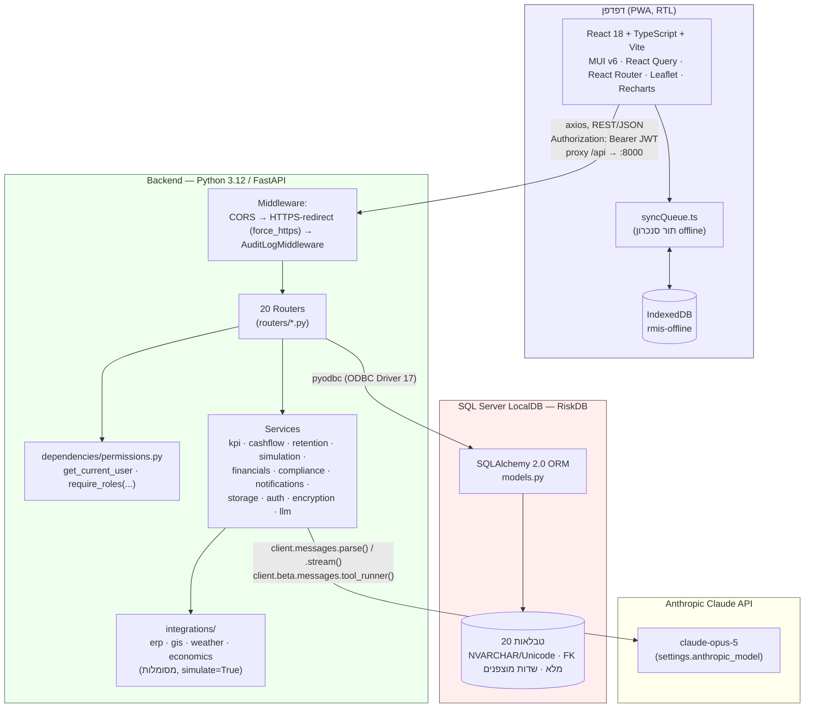
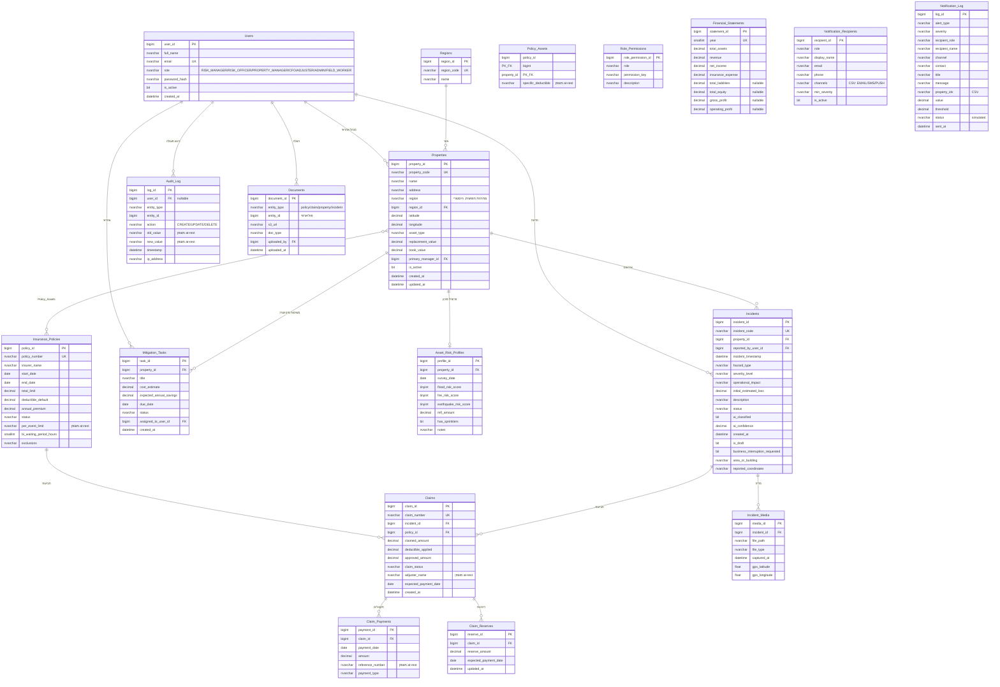
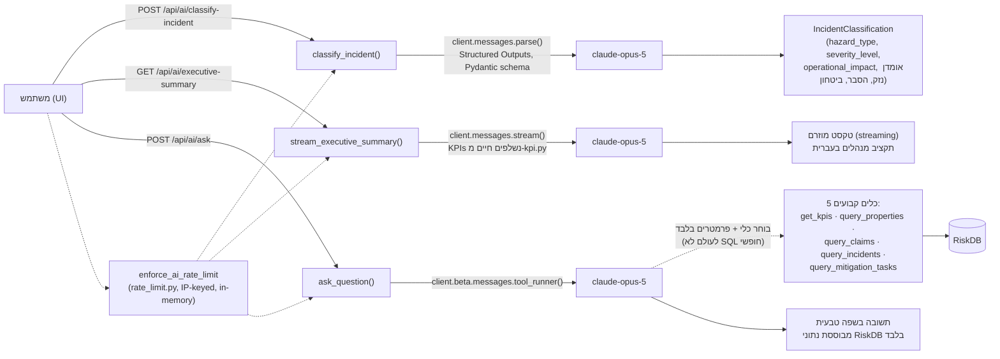
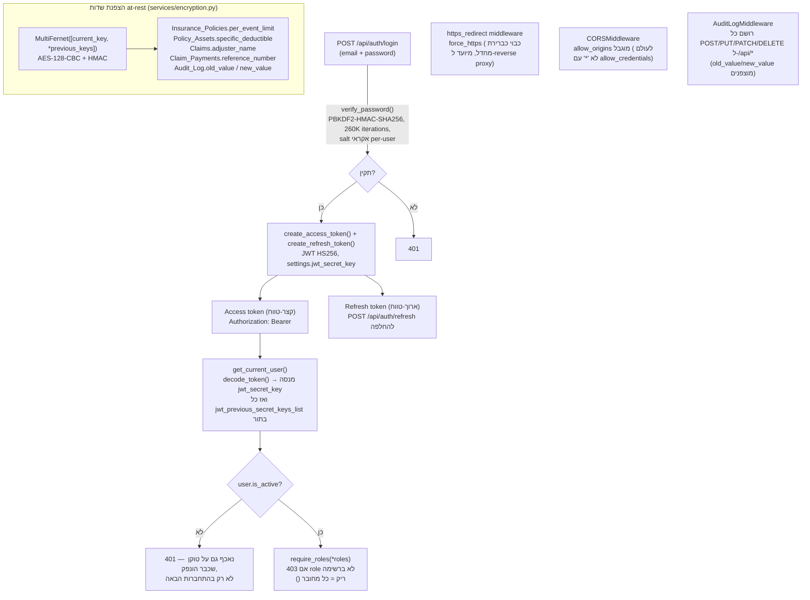
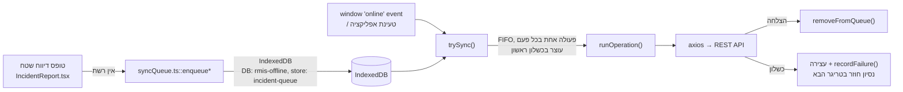

# ARCHITECTURE — תיעוד ארכיטקטורה טכני מפורט

מסמך זה הוא רפרנס ארכיטקטורה מפורט ל-RMIS, משלים ל-[docs/README.md](./README.md) (שנשאר מבוא/רציונל) ול-[docs/erd.md](./erd.md) (שנשאר ה-ERD העצמאי). כאן הדגש הוא: שכבות המערכת, שרשרת הערך של מודל הנתונים, שכבת ה-AI, ארכיטקטורת האבטחה, סנכרון offline, ושכבת האינטגרציות — עם תרשימי Mermaid. נבנה ע"י קריאה ישירה של `backend/app/models.py`, `backend/app/dependencies/permissions.py`, ו-`backend/app/routers/*.py` (לא הועתק מ-erd.md/README.md בלי אימות — ראו הערת "סטיות שהתגלו" בסוף כל סעיף רלוונטי).

## 1. שכבות המערכת (System Layers)



**זרימת בקשה טיפוסית** (למשל שמירת פרופיל סיכון לנכס):
`React component` → `frontend/src/api/client.ts` (axios, טיפוסי TS שמראים את `schemas.py`) → `PUT /api/properties/{id}/risk-profile` (`routers/risk_profiles.py`) → `Depends(require_roles(*_RISK_PROFILE_WRITE_ROLES))` בודק JWT+תפקיד → SQLAlchemy ORM (`models.AssetRiskProfile`) → `UPDATE` ב-`RiskDB` דרך pyodbc → `AuditLogMiddleware` רושם שורת ביקורת מוצפנת ל-`Audit_Log` → תשובת JSON חוזרת ל-React, מעדכנת את ה-cache של React Query.

## 2. שרשרת הערך של מודל הנתונים (Value-Chain Schema)

השרשרת המרכזית שסביבה בנוי הסכימה כולה:

```
Properties → Asset_Risk_Profiles → Incidents → Claims → Claim_Payments (+ Claim_Reserves)
```

בצירוף שני מסלולים לא-ליניאריים: `Insurance_Policies ↔ Properties` דרך טבלת קישור many-to-many `Policy_Assets`, ו-`Mitigation_Tasks` כענף עצמאי היוצא מ-`Properties` (ניהול תחזוקה מונעת + חישוב ROI).

### ERD מלא (מאומת מול `backend/app/models.py`, 2026-08-21)

> **הערת עדכניות:** תרשים זה נבדק שדה-שדה מול `models.py` בעת כתיבת מסמך זה ונמצא **תואם במלואו** ל-20 הטבלאות והעמודות הקיימות בפועל (כולל `Notification_Recipients`/`Notification_Log` שנוספו לאחרונה) — [docs/erd.md](./erd.md) כבר עודכן נכון וללא סטיות ב-schema עצמו. ההעתק כאן הוא כדי שמסמך הארכיטקטורה יהיה עצמאי (לא תלוי בקריאת קובץ נוסף); erd.md נשאר מקור ה-ERD הרשמי אם השניים ייסטו בעתיד.



### הערות מפתח לגבי הסכימה

- **`Policy_Assets`** היא טבלת קישור many-to-many אמיתית (PK מורכב `policy_id`+`property_id`) עם עמודת `specific_deductible` מוצפנת משלה, הדורסת את `deductible_default` של הפוליסה לנכס ספציפי.
- **`region` מול `region_id`**: `Properties.region` הוא שדה טקסט חופשי היסטורי; `region_id` (FK ל-`Regions`) הוא מבנה חדש יותר לדוח `GET /api/analytics/exposure-by-region`. שני שדות "אזור" שונים במכוון, ראו erd.md.
- שלוש טבלאות עצמאיות ללא FK כלל: `Financial_Statements`, `Notification_Recipients`, `Notification_Log` — כולן טבלאות תומכות/עצמאיות שאינן חלק משרשרת הערך הפיזית.
- **התראות סף** (`GET /api/analytics/alerts`, `services/kpi.py::calculate_alerts`) ו-**VaR/Monte Carlo** (`services/simulation.py`) ו-**מחשבון השתתפות עצמית** (`services/retention.py`) מחושבים "on the fly" מנתונים קיימים — אין להם טבלת תוצאות/ישות ב-ERD.

## 3. שכבת ה-AI (`routers/ai.py` + `services/llm.py`)



- **סיווג אירוע** (`POST /api/ai/classify-incident`) — `client.messages.parse()` מבטיח JSON תקין תמיד מול סכימת Pydantic (`llm.IncidentClassification`); ה-UI מציג את התוצאה כברת-עריכה, לא כופה.
- **דוח הנהלה** (`GET /api/ai/executive-summary`) — `client.messages.stream()`, מוגש כ-`StreamingResponse` בטקסט; שולף KPIs חיים לפני הפנייה למודל.
- **שאלות בשפה טבעית** (`POST /api/ai/ask`) — מאובטח בעיצוב: **חמישה כלים קבועים ופרמטריים בלבד** (`get_kpis`, `query_properties`, `query_claims`, `query_incidents`, `query_mitigation_tasks` — ב-`services/llm.py`), Claude בוחר כלי+פרמטרים דרך `client.beta.messages.tool_runner()`; אין נתיב שבו טקסט מהמשתמש הופך לביטוי SQL.
- **מודל:** `settings.anthropic_model` (ברירת מחדל `claude-opus-5`, ניתן לשינוי ב-`.env`).
- **Graceful degradation:** כל שלושת ה-endpoints קוראים ל-`_require_api_key()` בתחילת הפונקציה — ללא `ANTHROPIC_API_KEY` ב-`backend/.env` מוחזר `503` נקי במקום קריסה.
- **Rate limiting:** `router = APIRouter(..., dependencies=[Depends(enforce_ai_rate_limit), Depends(require_roles())])` — מגביל לפי IP (חלון-זמן קבוע, מונה בזיכרון תהליך, `services/rate_limit.py`) וגם מחייב התחברות (כל תפקיד), כדי להגן על מפתח ה-API מפני הצפה ומפני קוראים לא-מזוהים.

> **תוקן (branch `feature/ai-endpoints-require-auth`):** README תיעד מאז ומתמיד את `ai.py` כ"authenticated" ב-RBAC, אך עד לאחרונה בפועל **לא היה כלל `Depends(require_roles(...))` או `Depends(get_current_user)`** על אף אחד משלושת ה-endpoints — הבדיקה היחידה הייתה rate-limit לפי IP, כך ששלושת ה-endpoints היו פתוחים לכל קורא (גם לא-מחובר), בכפוף למכסת הקצב. נוסף `Depends(require_roles())` (כל תפקיד, לא מוגבל) ל-`router` כולו — עכשיו תואם בפועל למה שתמיד תועד ב-README ובמטריצת ההרשאות (ROLES_MATRIX.md).

## 4. ארכיטקטורת אבטחה (Security)



### 4.1 JWT + סבב מפתחות (rotation)
`services/auth.py`: סיסמאות נשמרות כ-`PBKDF2-HMAC-SHA256` (260,000 איטרציות, salt אקראי 16 בייט לכל משתמש) — לא bcrypt, כדי להימנע מ-toolchain C בסביבת קורס/Windows. JWT חתום ב-HS256. שני סוגי טוקן: `access` (קצר-טווח, נשלח בכל בקשה) ו-`refresh` (ארוך-טווח, מוחלף דרך `POST /api/auth/refresh`). **סבב מפתחות:** `decode_token` מנסה את `settings.jwt_secret_key` הנוכחי, ואם נכשל — עובר על `settings.jwt_previous_secret_keys_list` בתור; `_create_token` תמיד חותם עם המפתח הנוכחי בלבד. כך סבב מפתח לא מנתק מיידית משתמשים מחוברים — טוקנים שהונפקו לפני הסבב ממשיכים להיות מאומתים עד שפגים באופן טבעי. אין רשימת ביטול (revocation list) בצד השרת — `logout` הוא no-op לוגי בלבד, טרייד-אוף מקובל לדמו קורס עם JWT חסר-מצב (stateless).

### 4.2 הצפנת שדות at-rest + סבב מפתחות
`services/encryption.py`: `Fernet`/`MultiFernet` (מ-`cryptography`, AES-128-CBC+HMAC) מוחל **רק** על עמודות שאף פעם לא מסוכמות/ממוצעות ב-SQL (בניגוד ל-`Claim_Payments.amount`, `annual_premium` וכו', שנשארים לא-מוצפנים כי `services/kpi.py`/`financials.py` מבצעים עליהם `SUM`/`AVG` ישירות ב-SQL Server). חמש עמודות מוצפנות כיום: `Insurance_Policies.per_event_limit`, `Policy_Assets.specific_deductible`, `Claims.adjuster_name`, `Claim_Payments.reference_number`, `Audit_Log.old_value`/`new_value`. מומש כ-`TypeDecorator` (`EncryptedString`/`EncryptedText`) — קוד היישום קורא/כותב מחרוזות רגילות, ההצפנה/פענוח שקופים. **סבב מפתחות:** אותו דפוס כמו JWT — `MultiFernet([current_key, *previous_keys])`, כתיבה תמיד עם המפתח הנוכחי (הראשון), קריאה מנסה כל מפתח ברשימה. שורות שנכתבו לפני הכנסת ההצפנה (טקסט גלוי) נסבלות בקריאה: כישלון פענוח (`InvalidToken`) מחזיר את הערך הגולמי כמות שהוא, ללא שגיאה.

### 4.3 RBAC — `require_roles`
`dependencies/permissions.py`: `require_roles()` ללא ארגומנטים = "מחייב התחברות בלבד, כל תפקיד"; עם ארגומנטים = בדיקת השתייכות ל-`roles` (403 אחרת). נאכף ברמת endpoint בודד (`Depends(...)`) ברוב ה-routers על כל בקשת כתיבה (POST/PUT/PATCH/DELETE), וכן על קבוצת GET שמחשיפה מידע פיננסי (KPIs, cashflow, exposure, policies — ראו ROLES_MATRIX.md לפירוט המלא לפי router). endpoint ללא `Depends(require_roles(...))` כלל = פתוח לחלוטין, גם ללא התחברות — עדיין נכון עבור `simulation.py`, `retention.py`, ורוב ה-GET-ים של `analytics.py` (map/risk-matrix/alerts/hazard-distribution) שנשארים פתוחים במכוון (ר' ROLES_MATRIX.md). `ai.py` (ר' §3) **כבר אינו** ברשימה הזו — תוקן להשתמש ב-`Depends(require_roles())`.

### 4.4 force_https
`main.py`: middleware מותנה-קונפיגורציה (`settings.force_https`, כבוי כברירת מחדל) — מפנה `http`→`https` (308) לפי `X-Forwarded-Proto`, מיועד לפריסה מאחורי reverse proxy שמסיים TLS (אין תעודת TLS מקומית ב-`uvicorn --reload`).

### 4.5 Audit Log
`middleware/audit.py::AuditLogMiddleware` רושמת אוטומטית כל `POST`/`PUT`/`PATCH`/`DELETE` ל-`/api/*` לטבלת `Audit_Log` (כולל `old_value`/`new_value` מוצפנים — ה-payload יכול לכלול בעצמו שדות רגישים, למשל יצירת משתמש). נקראת רק דרך `GET /api/audit-log`, המוגבל ל-`ADMIN` בלבד גם לקריאה (היוצא-מן-הכלל המכוון ברשימת ה-GET הפתוחים).

## 5. ארכיטקטורת סנכרון Offline (`frontend/src/offline/syncQueue.ts`)



ארבעה סוגי פעולה מכסים את מחזור החיים המלא של דיווח אירוע offline: `create` (הגשה חדשה או שמירת טיוטה ראשונה — שתיהן צריכות את מלוא ה-payload כי אין עוד `id` בצד השרת), `draft-update` (עריכת טיוטה שכבר נוצרה online), `draft-submit` (סופי-מסירה של טיוטה קיימת — נמנע מיצירת אירוע כפול), `media` (צירוף תמונות לאירוע קיים שהעלאתו נכשלה). `registerAutoSync()` (נקרא פעם אחת מ-`main.tsx`) מפעיל סנכרון גם באירוע `online` וגם בטעינת האפליקציה אם כבר מחוברים. הסנכרון סדרתי-מכוון (FIFO, פעולה אחת בכל פעם, עוצר בכשלון ראשון) כדי לא "לשרוף" ניסיונות מחוץ לסדר במכשיר עדיין-offline/לא-יציב.

## 6. שכבת אינטגרציות (`backend/app/integrations/`)

ארבעה מודולים, **כולם מסומלים** (`simulate=True`) — אין credentials/API keys אמיתיים לספקים חיצוניים בסביבת הדמו:

| מודול | תפקיד | נחשף דרך |
|---|---|---|
| `erp.py` | שווי ספרים (book values) מדומה + רישום קבלות תביעה (posting) ל-ERP מדומה | `GET /api/integrations/erp/book-values`, `POST /api/integrations/erp/post-claim-receipts` |
| `gis.py` | שכבות סיכון גיאוגרפיות מדומות (הצפה/אקלים) | `GET /api/integrations/gis/risk-layers` |
| `weather.py` | התראות מזג-אוויר מדומות | `GET /api/integrations/weather/alerts` (פתוח לכל מחובר) |
| `economics.py` | מדדים כלכליים + עדכוני שווי החלפה מדומים | `GET /api/integrations/economics/index-series`, `/economics/replacement-value-updates` |

כל מודול נכתב כך שקל להחליף בקריאת HTTP אמיתית ביום שיהיו פרטי חיבור אמיתיים (ראו docs/README.md §9 לרשימת "מה מחוץ להיקף" המלאה — כולל שליחת Email/SMS/Push אמיתית, אחסון S3/Blob אמיתי, SSO/OAuth2 אמיתי).

## 7. הפניות

- [docs/README.md](./README.md) — רקע, רציונל, קטלוג endpoints ברמת router, הרצה מקומית, מלכודות פיתוח.
- [docs/erd.md](./erd.md) — ה-ERD הרשמי (מקור אמת לתרשים בפני עצמו) + הרחבות טקסטואליות לכל טבלה.
- [ROLES_MATRIX.md](./ROLES_MATRIX.md) — מטריצת הרשאות read/write לכל תפקיד מול כל router, נגזרת ישירות מ-`require_roles(...)` בקוד.
- [backend/app/models.py](../backend/app/models.py) — מקור האמת למודל ה-ORM.
- [backend/sql/schema.sql](../backend/sql/schema.sql) — מקור האמת ל-DDL על DB חדש.
