# ERD — תרשים ישויות וקשרים

מעודכן נכון להוספת `Notification_Log` ב-TODO_SPEC.md §1 (20 טבלאות). מקור האמת ל-DDL בפועל: [backend/sql/schema.sql](../backend/sql/schema.sql); מקור האמת למודל ה-ORM: [backend/app/models.py](../backend/app/models.py) — שני הקבצים מתוחזקים יד-ביד (ראו [CLAUDE.md](../CLAUDE.md)); Alembic (`backend/alembic/`) עוקב אחרי שינויים הדרגתיים קדימה מנקודת הבסיס, לא מחליף את `schema.sql` ליצירת סכימה על DB חדש.

```mermaid
erDiagram
    Users ||--o{ Properties : "מנהל אחראי"
    Users ||--o{ Incidents : "מדווח"
    Users ||--o{ Mitigation_Tasks : "אחראי"
    Users ||--o{ Audit_Log : "ביצע פעולה"
    Users ||--o{ Documents : "העלה"

    Regions ||--o{ Properties : "אזור"

    Properties ||--o| Asset_Risk_Profiles : "פרופיל סיכון"
    Properties ||--o{ Incidents : "אירועים"
    Properties ||--o{ Mitigation_Tasks : "משימות מיטיגציה"
    Properties }o--o{ Insurance_Policies : "Policy_Assets"

    Insurance_Policies ||--o{ Claims : "תביעות"
    Incidents ||--o{ Claims : "תביעות"
    Incidents ||--o{ Incident_Media : "מדיה"
    Claims ||--o{ Claim_Payments : "תקבולים"
    Claims ||--o{ Claim_Reserves : "רזרבות"

    Properties {
        bigint property_id PK
        nvarchar property_code UK
        nvarchar name
        nvarchar address
        nvarchar region "מחרוזת חופשית, היסטורי"
        bigint region_id FK "חדש: קישור מובנה ל-Regions"
        decimal latitude
        decimal longitude
        nvarchar asset_type
        decimal replacement_value
        decimal book_value
        bigint primary_manager_id FK
        bit is_active
        datetime created_at
        datetime updated_at
    }

    Regions {
        bigint region_id PK
        nvarchar region_code UK
        nvarchar name
    }

    Asset_Risk_Profiles {
        bigint profile_id PK
        bigint property_id FK
        date survey_date
        tinyint flood_risk_score
        tinyint fire_risk_score
        tinyint earthquake_risk_score
        decimal mfl_amount
        bit has_sprinklers
        nvarchar notes
        bit near_hazmat_site "חדש: קרבה למפעל חומ״ס"
    }

    Insurance_Policies {
        bigint policy_id PK
        nvarchar policy_number UK
        nvarchar insurer_name
        date start_date
        date end_date
        decimal total_limit
        decimal deductible_default
        decimal annual_premium
        nvarchar status
        nvarchar per_event_limit "גבול לאירוע בודד; מוצפן at-rest"
        smallint bi_waiting_period_hours "חדש: תקופת המתנה BI"
        nvarchar exclusions "חדש: החרגות"
    }

    Policy_Assets {
        bigint policy_id PK_FK
        bigint property_id PK_FK
        nvarchar specific_deductible "מוצפן at-rest"
    }

    Incidents {
        bigint incident_id PK
        nvarchar incident_code UK
        bigint property_id FK
        bigint reported_by_user_id FK
        datetime incident_timestamp
        nvarchar hazard_type
        nvarchar severity_level
        nvarchar operational_impact
        decimal initial_estimated_loss
        nvarchar description
        nvarchar status
        bit ai_classified
        decimal ai_confidence
        datetime created_at
        bit is_draft "חדש: טיוטה טרם הוגשה"
        bit business_interruption_requested "חדש: בקשת כיסוי אובדן רווחים"
        nvarchar area_or_building "חדש: אזור/מבנה בתוך הנכס"
        nvarchar reported_coordinates "חדש: GPS המדווח, 'lat,lng'"
        nvarchar resolved_address "חדש: כתובת מפוענחת (Reverse Geocoding)"
    }

    Incident_Media {
        bigint media_id PK
        bigint incident_id FK
        nvarchar file_path
        nvarchar file_type
        datetime captured_at
        float gps_latitude "מ-EXIF, אם קיים"
        float gps_longitude "מ-EXIF, אם קיים"
    }

    Claims {
        bigint claim_id PK
        nvarchar claim_number UK
        bigint incident_id FK
        bigint policy_id FK
        decimal claimed_amount
        decimal deductible_applied
        decimal approved_amount
        nvarchar claim_status
        nvarchar adjuster_name "מוצפן at-rest"
        date expected_payment_date
        datetime created_at
    }

    Claim_Payments {
        bigint payment_id PK
        bigint claim_id FK
        date payment_date
        decimal amount
        nvarchar reference_number "מוצפן at-rest"
        nvarchar payment_type
    }

    Claim_Reserves {
        bigint reserve_id PK
        bigint claim_id FK
        decimal reserve_amount
        date expected_payment_date
        datetime updated_at
    }

    Mitigation_Tasks {
        bigint task_id PK
        bigint property_id FK
        nvarchar title
        decimal cost_estimate
        decimal expected_annual_savings
        date due_date
        nvarchar status
        bigint assigned_to_user_id FK
        datetime created_at
    }

    Users {
        bigint user_id PK
        nvarchar full_name
        nvarchar email UK
        nvarchar role "RISK_MANAGER/RISK_OFFICER/PROPERTY_MANAGER/CFO/ADJUSTER/ADMIN/FIELD_WORKER"
        nvarchar password_hash
        datetime created_at
    }

    Audit_Log {
        bigint log_id PK
        bigint user_id FK "NULL-אבל, אם לא זוהה מבצע הפעולה"
        nvarchar entity_type
        bigint entity_id
        nvarchar action "CREATE/UPDATE/DELETE"
        nvarchar old_value "מוצפן at-rest"
        nvarchar new_value "מוצפן at-rest"
        datetime timestamp
        nvarchar ip_address
    }

    Role_Permissions {
        bigint role_permission_id PK
        nvarchar role
        nvarchar permission_key
        nvarchar description
    }

    Documents {
        bigint document_id PK
        nvarchar entity_type "policy/claim/property/incident"
        bigint entity_id "פוליארפי לפי entity_type, לא FK יחיד"
        nvarchar s3_url
        nvarchar doc_type
        bigint uploaded_by FK
        datetime uploaded_at
    }

    Financial_Statements {
        bigint statement_id PK
        smallint year UK
        decimal total_assets
        decimal revenue
        decimal net_income
        decimal insurance_expense
        decimal total_liabilities "nullable"
        decimal total_equity "nullable"
        decimal gross_profit "nullable"
        decimal operating_profit "nullable"
    }

    Notification_Recipients {
        bigint recipient_id PK
        nvarchar role
        nvarchar display_name
        nvarchar email
        nvarchar phone
        nvarchar channels "CSV subset of EMAIL/SMS/PUSH"
        nvarchar min_severity "warning/critical"
        bit is_active
    }

    Notification_Log {
        bigint log_id PK
        nvarchar alert_type "geographic_exposure/incident_concentration"
        nvarchar severity "warning/critical"
        nvarchar recipient_role
        nvarchar recipient_name
        nvarchar channel "EMAIL/SMS/PUSH"
        nvarchar contact
        nvarchar title
        nvarchar message
        nvarchar property_ids "CSV bigint list"
        decimal value
        decimal threshold
        nvarchar status "simulated"
        datetime sent_at
    }
```



## שרשרת הערך המרכזית

```
נכס פיזי (Properties)
   → פרופיל סיכון (Asset_Risk_Profiles)
      → אירוע נזק (Incidents)  ←  AI מסווג אוטומטית, נתמך Draft→Submitted
         → תביעת ביטוח (Claims)  ←  משוייכת ל-Insurance_Policies
            → תקבולים (Claim_Payments)  +  רזרבות פתוחות (Claim_Reserves)
```

מקביל, ומחוץ לשרשרת הליניארית:

- **`Mitigation_Tasks`** מקשר `Properties` להמלצות תחזוקה מונעת עם חישוב ROI (`kpi.calculate_mitigation_roi_breakdown`), כולל חישוב `OVERDUE` אוטומטי לפי `due_date`.
- **`Policy_Assets`** הוא טבלת קישור many-to-many בין `Properties` ל-`Insurance_Policies` (נכס יכול להיות מכוסה במספר פוליסות; פוליסה מכסה מספר נכסים), עם אפשרות להשתתפות עצמית ספציפית-לנכס שדורסת את ברירת המחדל של הפוליסה.
- **`Regions`** + `Properties.region_id` (חדש) מאפשרים דוח חשיפה מנהלי לפי אזור מנהלי (`GET /api/analytics/exposure-by-region`), בנפרד מהשדה החופשי הישן `Properties.region` (שלא הוחלף, כדי לא לשבור התאמות קיימות) ובנפרד מהקיבוץ הגיאוגרפי-פיזי לפי קרבה בק"מ (`GET /api/analytics/geographic-exposure-clusters`) — שלושה מושגי "אזור" שונים ומכוונים.
- **`Audit_Log`** נכתבת אוטומטית על ידי `AuditLogMiddleware` לכל בקשת POST/PUT/PATCH/DELETE ל-`/api/*` (ראו `backend/app/middleware/audit.py`), ונקראת רק דרך `GET /api/audit-log` המוגבל לתפקיד `ADMIN` בלבד (ראו [מסך יומן הביקורת](../frontend/src/pages/AuditLog.tsx)).
- **`Role_Permissions`** מגדירה מטריצת הרשאות תיאורית (role → permission_key) המוצגת/נצרכת כתיעוד; האכיפה בפועל היא ברמת ה-endpoint דרך `dependencies/permissions.py::require_roles(...)`, לא שאילתה חיה כנגד הטבלה הזו.
- **`Documents`** מקשרת קבצים (פוליסות, דוחות שמאי, תכתובות) לכל אחת מארבע ישויות (`policy`/`claim`/`property`/`incident`) בדפוס פוליארפי — `entity_type` + `entity_id` בלבד, לא ארבעה FK-ים נפרדים nullable (אותו דפוס גם ב-`Audit_Log`).
- **`Financial_Statements`** היא טבלה עצמאית (ללא FK), שורה אחת לשנה, המשמשת את `services/financials.py` לניתוח מגמות רב-שנתי ואת הדוח הרגולטורי (`GET /api/financials/regulatory-report`).
- **`Notification_Recipients`** היא טבלה עצמאית (ללא FK) שמחליפה את רשימת ה-`DEFAULT_RECIPIENTS` הקבועה-בקוד הקודמת ב-`services/notifications.py`: מי מקבל התראות סף ובאילו ערוצים (`channels` — מחרוזת CSV מתוך EMAIL/SMS/PUSH, ללא סוג עמודת מערך ב-SQL Server). `services/notifications._load_recipients` קורא ממנה שורות פעילות (`is_active=1`), עם נפילה חזרה ל-`DEFAULT_RECIPIENTS` אם הטבלה ריקה. ניהול (CRUD) דרך `POST/PATCH/DELETE /api/notifications/recipients`, מוגבל ל-`ADMIN`.
- **`Notification_Log`** היא טבלה עצמאית (ללא FK) המשמשת כ-Audit Trail להתראות שנשלחו בפועל: `services/notifications.dispatch_notifications` כותב אליה שורה אחת לכל צירוף (התראה, נמען, ערוץ) שנשלח (מדומה, `status='simulated'`), בנוסף ללוגינג הזמני שכבר היה קיים (`logger.log`) שאינו נשמר לאחר סיום התהליך. נקראת דרך `GET /api/notifications/log` (אותה קבוצת תפקידים כמו `/preview`/`/dispatch`), ללא endpoint לכתיבה ידנית — האפליקציה עצמה היא הכותבת היחידה.

## התראות סף (Threshold Alerts)

התראות הסף המוצגות ב-`GET /api/analytics/alerts` (ריכוז חשיפה גיאוגרפית מעל אחוז מסוים מה-TIV, וריכוז אירועים פתוחים בנכס בודד) **אינן ישות מתמידה בסכמה** — הן מחושבות "on the fly" מתוך `Properties`, `Asset_Risk_Profiles` ו-`Incidents` הקיימים (ראו `backend/app/services/kpi.py::calculate_alerts`), ולכן לא נוסף טבלה/ישות חדשה לתרשים ה-ERD עבור תכונה זו. אותו עיקרון חל על סימולציית ה-Monte Carlo/VaR (`services/simulation.py`) ומנוע האופטימיזציה של השתתפות עצמית (`services/retention.py`) — שניהם מחושבים על נתונים קיימים בזמן קריאה, ללא טבלת תוצאות משלהם.
