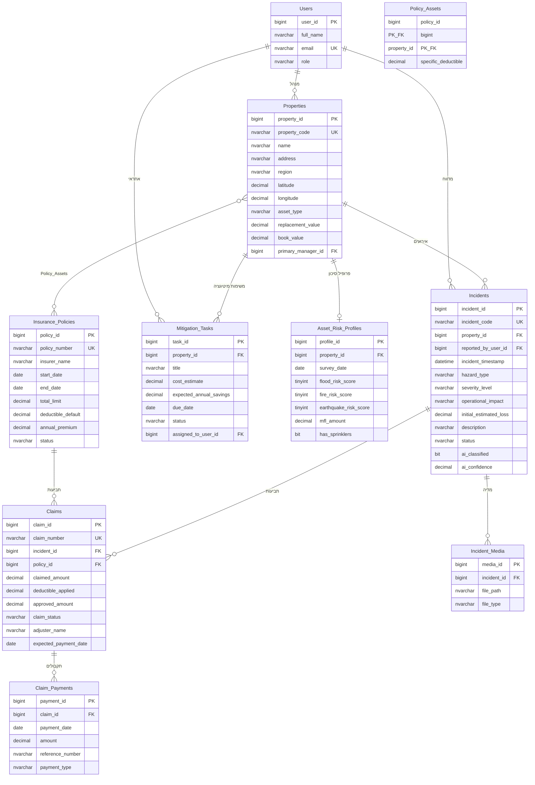

# ERD — תרשים ישויות וקשרים



## שרשרת הערך המרכזית

```
נכס פיזי (Properties)
   → פרופיל סיכון (Asset_Risk_Profiles)
      → אירוע נזק (Incidents)  ←  AI מסווג אוטומטית
         → תביעת ביטוח (Claims)  ←  משוייכת ל-Insurance_Policies
            → תקבולים (Claim_Payments)
```

מקביל, ומחוץ לשרשרת הליניארית: `Mitigation_Tasks` מקשר `Properties` להמלצות תחזוקה מונעת עם חישוב ROI, ו-`Policy_Assets` הוא טבלת קישור many-to-many בין `Properties` ל-`Insurance_Policies` (נכס יכול להיות מכוסה במספר פוליסות; פוליסה מכסה מספר נכסים).
